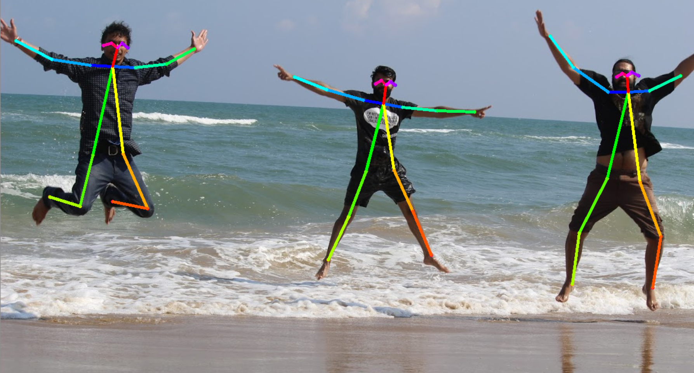
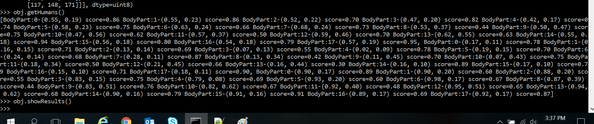

# poseEstimator
The repo includes code for estimating human pose on 2D images/videos. It uses the works of 
`[ildoonet/tf-pose-estimation]`(https://github.com/ildoonet/tf-pose-estimation)

## Inspiration
Imagine of identying what a person is doing from an image. OpenPose is a library 
that does this for us. It gives accurate position and orientation information.
Pose Estimation can be applied to n number of usecases and build some cool applications using it. <br />
Few examples where it can be applied to can be self driving cars, in retail, i.e. identifying consumer
interactions with products, in smartphone gesture based camera applications etc.
<p align="center">
	
</p>
PS it cool stuff to try your hands on!!

## Requirements
```
Linux (Tested on Windows 10)
Python
Python Packages
 - opencv-python
 - TensorFlow1.4+
 - protobuf
 - python3-tk
```
you can install the python package using `pip install <package_name>` <br />
Build c++ library for post processing
```
cd tf_pose/pafprocess
swig -python -c++ pafprocess.i && python3 setup.py install
```
## Pretrained Models
CMU model gives a better performance, but the graph files are large therfore it
may not be feasible to run inference on mobile platforms or using it in real time 
applications. However you can easily infere using CMU on your PC. 
The graph files are too large to commit in git, so you can download them,
and place it under the directory `./models/graph/cmu/`. download script for them
is under the same directory.

For real time performance on EDGE devices, you can go for `mobilnet` model.
Performance from an accuracy point might be a little less but then it provides 
a high FPS and can be leveraged in applications requiring pose estimation in 
real time. Graph files for it are already present in the repo. <br />
`ls ./models/graph/mobilnet_thin`

## Implementation
`pose_estimate.py` defineds the class PoseEstimator which manages all operations related to 
Pose Estimation. It acts as a wrapper on top of the TfPoseEstimator which is implemented inside 
the openpose model. The class supplies human pose coordinates to requestor objects. The constructor
of the class looks like:<br />
```
def __init__(self, resize='0x0', model='mobilenet_thin'):

        self.humans = None      # list of humans with pose info
        self.image = None
        self.bboxes = []        # list of bbox [x1, y1, x2, y2]
		self.model = model
		self.w, self.h = model_wh(resize)
        self.loadModel()
```
Two available models are cmu & mobilenet_thin if running in CPU mode only, 
then mobilenet_thin is recommended. Default fetches mobilenet_thin.
if resize value is provided, it will resize images before they are processed. default=0x0 
(You can try with default value for now)
Recommends:	432x368 or 656x368 or 1312x736

#### Image Inference
To initialize the class: 
```
import cv2
from pose_estimate import PoseEstimator
obj = PoseEstimator()
```
To infer on an image, you can call the `infer` method on previously created object `obj`:
```
def infer(self, image):
    self.image = image
    if self.image is None:
        raise Exception('The image is not valid. check your image')

    self.humans = self.e.inference(self.image,
            resize_to_default=(self.w > 0 and self.h > 0),
            upsample_size=self.resize_out_ratio)
    self.image = TfPoseEstimator.draw_humans(self.image, self.humans,
            imgcopy=False)
    return self.image
```
the infer method calls the inference API inside tf_pose (openpose)
returning the poses of humans and drawing the skeleton
on image frame
```
image = cv2.imread('images/two.JPG')
obj.infer(image)
```
To get the list of humans(along with their body parts coordinates & confidence score), 
you can call the `obj.getHumans()` method <br />
<p align="center">
	
</p>

To visually see the result, you can call the `obj.showResults` method <br />
<p align="center">
	
</p>

#### Realtime Inference
`test_poseEstimator.py` will access your webcam & estimate the pose in real time. <br />
```
python test_pose_estimator.py
```
Running it on my PC with hardware spec:
```
QuadCore i5 processor
RAM: 4Gb
```
FPS value using `mobilenet_thin` is `7~8` <br />
FPS value using `CMU` is `4~5` <br />

## References
- https://github.com/ildoonet/tf-pose-estimation
- https://github.com/CMU-Perceptual-Computing-Lab/openpose
